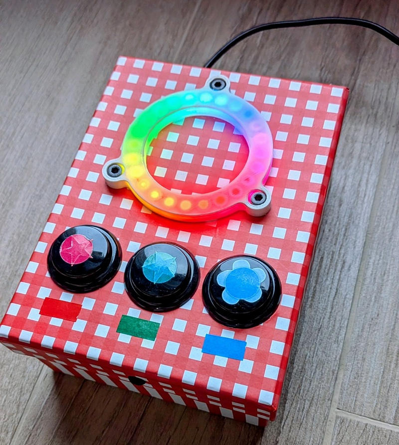

# Arduino LED toy with neopixel ring and arcade buttons

This project is a simple interactive toy I built for my kids as a Christmas gift, back in 2020. 
I lost the final version of the original firmware a long time ago, so I created this repository to try to rebuild and recover it as accurately as possible, based on incomplete backups.
It is housed inside a cardboard box and powered by an **Arduino Uno**, featuring a **24-LED Adafruit NeoPixel Ring** and **three arcade-style push buttons**.

The toy uses colors, light patterns, and basic interaction to create different engaging experiences for young children.

  

---

## Features

- **24-LED Adafruit NeoPixel Ring** for bright and colorful animations  
- **Three arcade machine push buttons**  
  - Each button triggers a different light pattern  
  - Designed to be easy for toddlers to press  
- **Simple menu system** that uses the three buttons to select between different animation modes  
- **Reset gesture**: pressing all three buttons at the same time resets the toy to its initial state  
- **Arduino Uno–based control logic**  
- **Durable cardboard enclosure** (simple DIY build)  
- Safe, simple, and fun for small kids

---

## How It Works

Each of the three arcade buttons is connected to a digital input on the Arduino.  
When pressed, the program triggers a unique animation on the neopixel ring, such as:

- Rotating colors  
- Sparkle effects  
- Solid color pulses
- Rainbow chase patterns  

The toy is meant to be intuitive: press a button → enjoy the lights.

On top of that, the sketch implements a very small **menu system**:

- Each button is associated with a specific **mode** or **animation profile**.  
- Pressing a button changes the current menu selection and updates the active LED effect accordingly.  
- The selected mode keeps running until another button is pressed and a new mode is chosen.

To make it easy to “start over”, there is also a **reset gesture**:

- When **all three buttons are pressed at the same time**, it resets the internal state and returns to the **default mode**, as if the toy had just been powered on.

---

## Hardware Used

- **Arduino Uno**  
- **Adafruit NeoPixel Ring – 24 LEDs**  
- **3 × Arcade-style push buttons**  
- Resistors for button debouncing (optional depending on wiring)  
- 5V power supply (USB or external)  
- Jumper wires  
- Cardboard box (enclosure)

---